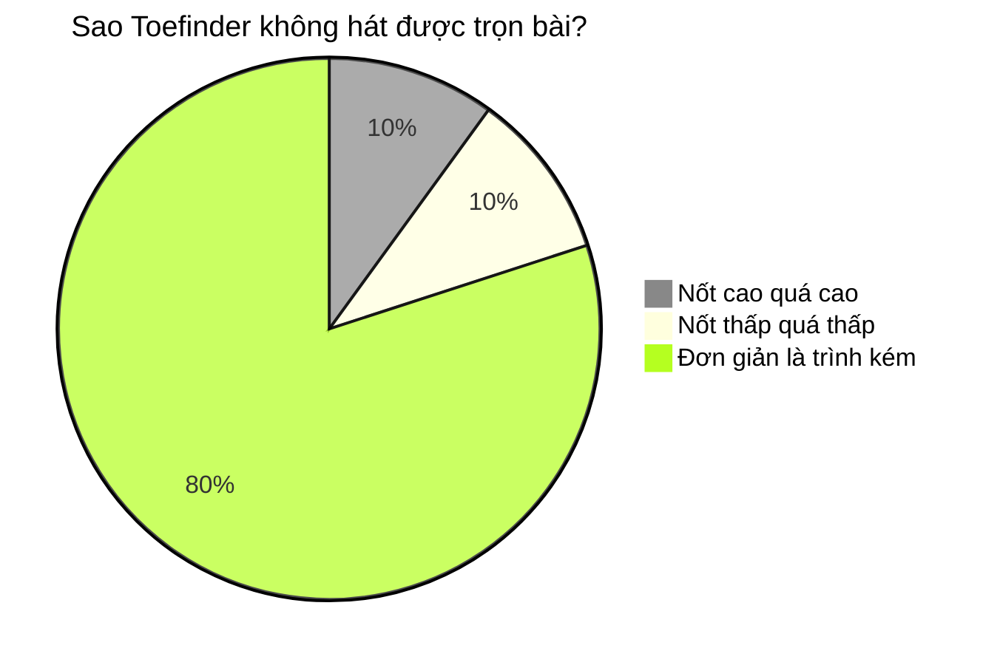

Bẵng đi một thời gian, không có thêm hoạt động gì về ban nhạc trong trí tưởng tượng của tôi và Vân.
Tôi vẫn ngày đi làm, đêm cày Netflix (không chill). Khi xem Netflix mệt nghỉ (đáng tiếc là tôi cày
khỏe), tôi mới lôi cây đàn từ trong xó phòng ra ê a vài bài. Một trong những bài hát tôi thích ở
thời điểm đó là "Những lời hứa bỏ quên" của hoàng tử Indie Việt aka đại ca Vũ. Cáu một điều là, mỗi
lần ê a bài hát này trong phòng, thì tôi chỉ hát được mỗi đoạn verse. Khi bài hát bay tới cao trào
ở điệp khúc, thì giọng tôi rơi đài như là diều đứt dây...

Tôi bèn hỏi Thái, một người bạn học hát đã
lâu năm, làm cách nào tập luyện đẩy quãng giọng lên một chút xíu, để tôi biểu diễn cho trọn bài.

Thái chỉ cho tôi vài điều về cách lấy hơi, cách đặt vị trí âm thanh, rồi chốt lại một câu: muốn hát
hay, phải hay hát, và tập hát bài bản!
Cao hứng học được vài điều mới, tôi tiện thể "khoe" về việc tôi lập ban nhạc.

"Có slot không?" ~ Thái hỏi. 
"Có có có!!!" ~ tôi mừng rơn. 
"Thế bình thường bọn ông tập ở đâu?" 
"..." 
"Bọn ông tập được những bài gì rồi?" 
"..." 
"Thế chiều nay mình làm quả Zoom Call nói chuyện nhỉ, xem tình hình thế nào" 
"OK!"

Ngay chiều hôm đấy, bọn tôi có buổi họp online đầu tiên.
Mỗi người chia sẻ về bản thân, về thể loại nhạc mình yêu thích. Trùng hợp thay, cả 3 đứa đều thích âm nhạc có nhiều năng lượng, thậm chí nhạc buồn thì cũng muốn "gào thét" một tí chứ
không phải bi ai trầm cảm.
Sau đó, mỗi người đều tự thể hiện một bài hát mình mê.
Cuộc họp bị gián đoạn nhiều lần vì dùng Zoom free account có giới hạn thời gian họp,
rồi Thái cũng cần thời gian chỉ cho 2 đứa nhóc bọn tôi cách
dùng Zoom Studio mode để giảm độ lag lúc biểu diễn.
Nhưng cuộc họp đã khiến cho band không còn là một khái niệm trừu tượng, mà là một thứ đã bắt đầu trên lộ trình.
Chúng tôi đã có lịch hẹn cho cuộc họp tiếp theo, và một số mục tiêu nhỏ để cùng thảo luận.

Quả là:

> Tổ chức nào cũng cần có sói đầu đàn. 
> Ban nhạc nào cũng cần một lead vocalist!

Nhưng đây mới chỉ là khởi đầu, nhiều điều thú vị còn nằm ở phía trước.
Cùng đón xem hồi tiếp theo để biết được câu chuyện thành lập đầy lí thú của tụi mình nhé.
